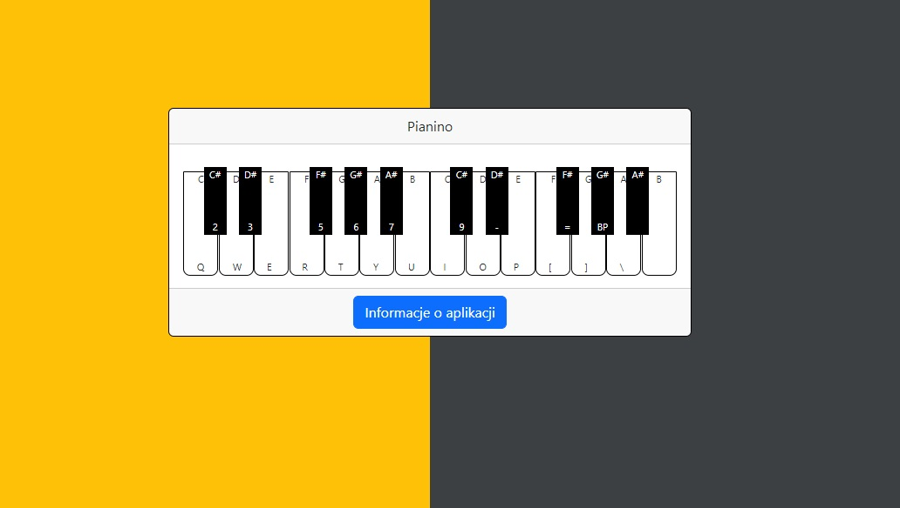

# :desktop_computer: Piano

The application presents a piano keyboard with letter notes displayed on the keys. The keys are labeled with the corresponding keyboard button markings found on a piano. When a key is clicked, the application plays the sound of the corresponding piano note.

## :framed_picture: Screenshots

## :joystick: Demo

https://kamilkeder.github.io/Piano/

## :e-mail: Feedback

If you have any feedback, please reach out to me at kontaktkkeder@gmail.com
